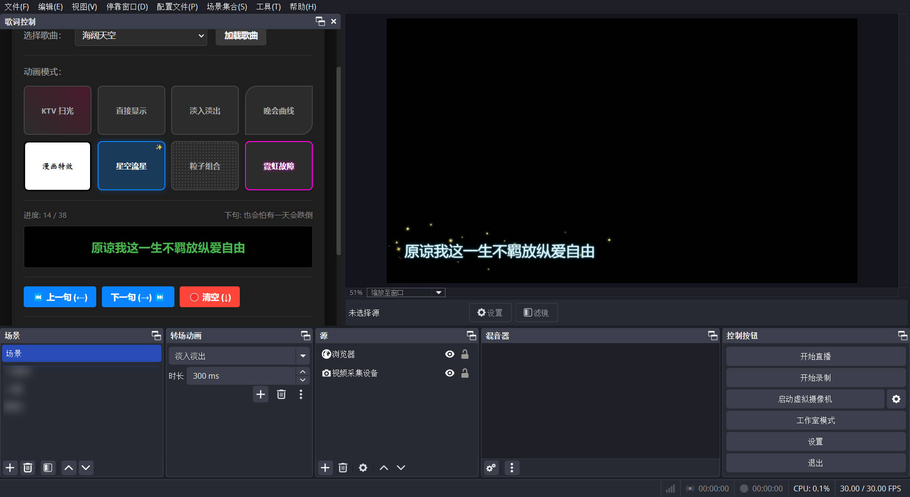
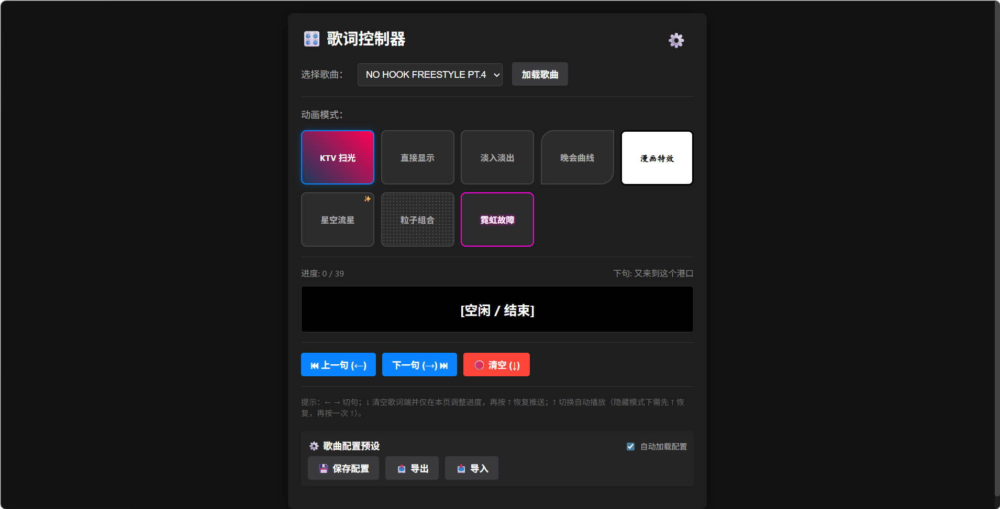
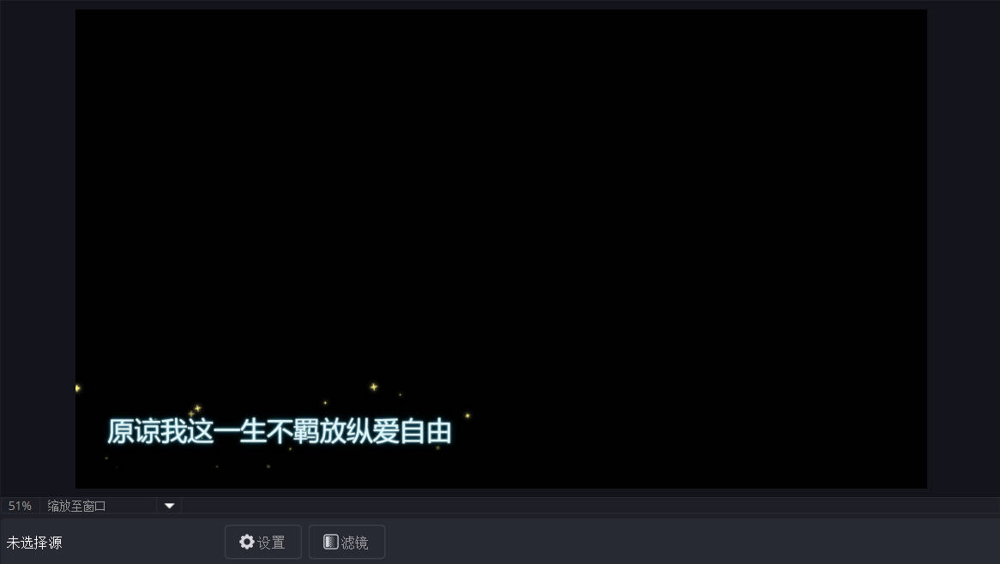
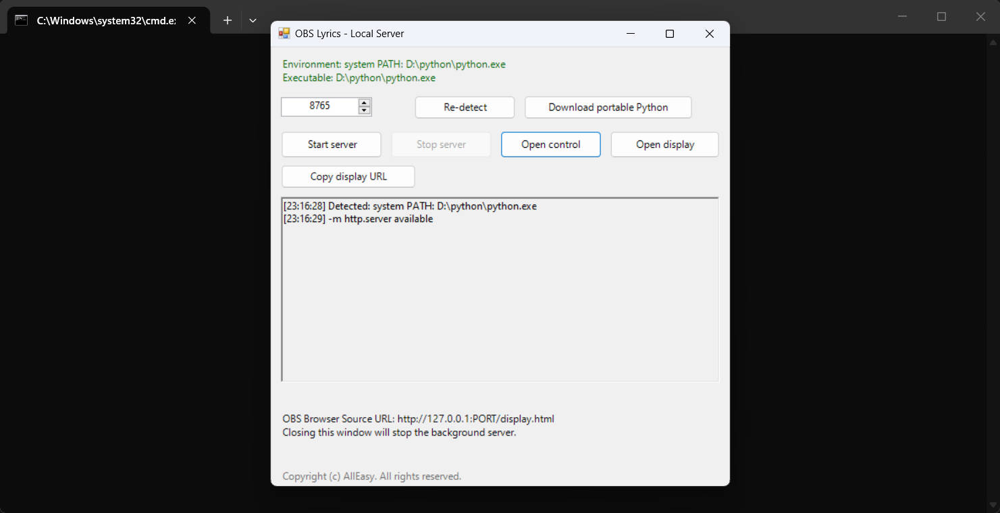
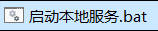
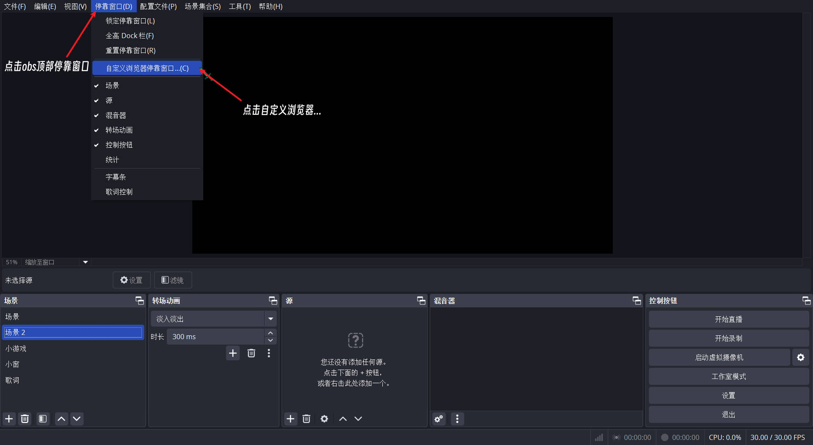
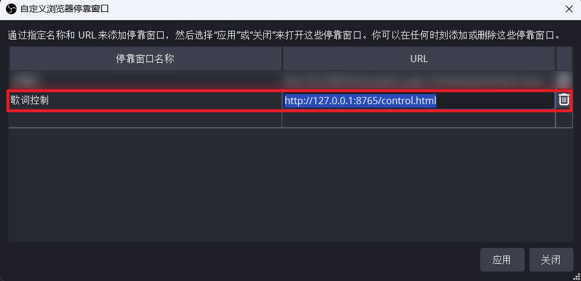
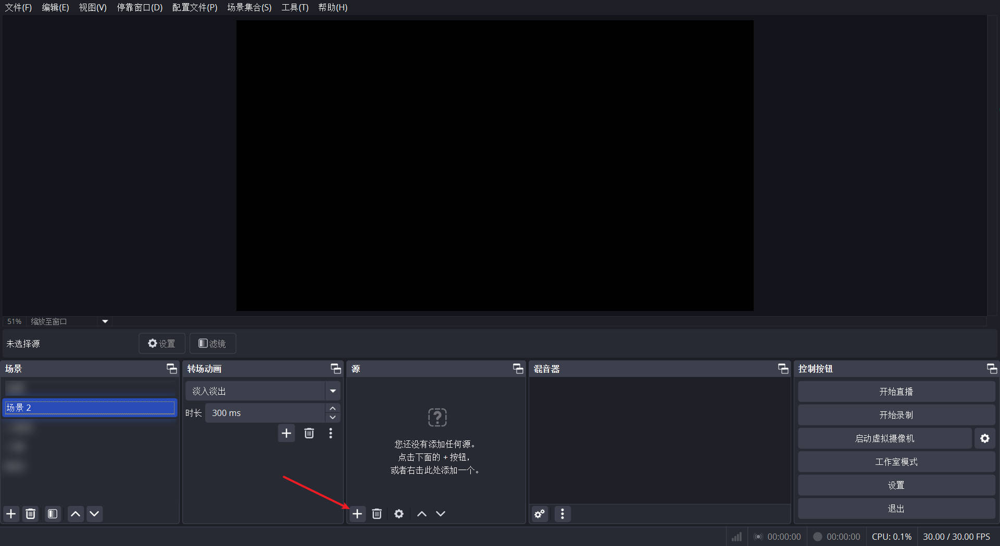
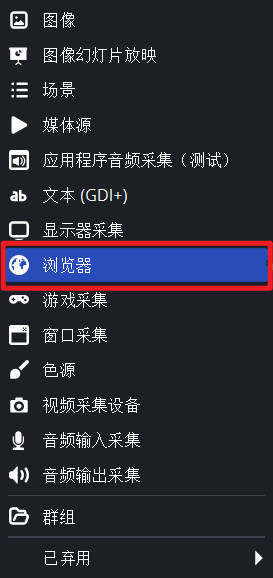
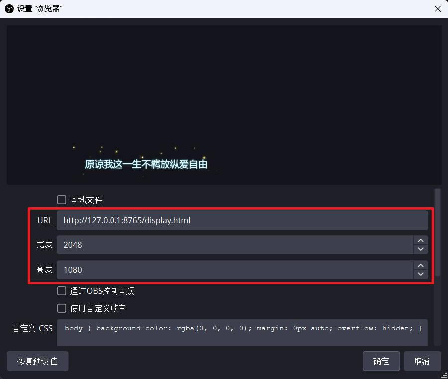

<<<<<<< HEAD
# OBS Lyrics Plugin

一个为 OBS 直播/录播场景设计的本地歌词控制与显示工具。  
它提供独立的控制端和显示端，支持歌词切句、自动播放、多种动画特效、颜色字体配置和预设管理，适合直播演唱、音乐节目、舞台字幕、录播歌词包装等场景。

> Copyright (c) AllEasy

## 效果预览

> 这里可以放项目截图。上传到 GitHub 后，你可以把图片放到 `docs/images/` 目录，再替换下面的路径。

### 控制端


### OBS 显示端


### 本地启动器


## 项目亮点

- **面向 OBS 使用**：显示端可直接作为 OBS Browser Source 使用。
- **控制端/显示端分离**：控制页面负责选歌、切句、配置；显示页面只负责干净展示。
- **多种歌词特效**：包含 KTV 扫光、直接显示、淡入淡出、晚会曲线、漫画、星空、粒子、霓虹故障等模式。
- **快捷键操作**：支持方向键切句、清空、恢复推送和自动播放切换，适合直播时快速操作。
- **隐藏推送调整**：按下向下键后可在控制端调整歌词进度，不立即推送到 OBS 显示端。
- **配置预设**：可保存、导入、导出歌曲相关配置。
- **本地 GUI 启动器**：无需依赖 VS Code Live Server，可通过启动器开启本地 HTTP 服务。

## 功能列表

- 歌曲选择与加载
- LRC / JSON 歌词支持
- 上一句 / 下一句 / 清空歌词端
- 自动播放
- 多种动画模式
- 字体配置
- 颜色主题配置
- 歌曲配置预设保存、导入、导出
- 本地资源扫描与配置更新
- Windows GUI 启动器
- OBS Browser Source 显示端

## 快速开始

### 1. 启动本地服务

双击项目根目录中的：

```text
启动本地服务.bat
```

默认会打开 GUI 启动器。启动器会自动检测 Python 环境，也可以下载便携版 Python 到插件目录中。

如果 GUI 启动失败，会自动回退到命令行启动方式：

```text
启动本地服务-命令行.bat
```

### 2. 打开控制端

默认控制端地址：

```text
http://127.0.0.1:8765/control.html
```

### 3. 配置 OBS 显示端

在 OBS 中添加 Browser Source，并填写：

```text
http://127.0.0.1:8765/display.html
```

如果你在启动器里修改了端口，请同步修改 URL 中的端口号。

## 快捷键

- `←`：上一句
- `→`：下一句
- `↓`：清空歌词端，并进入仅控制端调整状态
- `↑`：恢复推送 / 切换自动播放

说明：当歌词端被隐藏后，左右键只会调整控制端进度，不会立即显示到歌词端。再次按 `↑` 会先恢复当前句显示；如果歌词已经在显示，再按 `↑` 会切换自动播放。

## 歌词资源

项目支持两种歌词来源：

- `.lrc`：常见 LRC 歌词格式
- `.json`：项目自定义歌词数据格式

歌词文件通常放在：

```text
lyrics/
```

JSON 歌词文件支持以下歌曲信息字段：

```json
{
  "songName": "歌曲名",
  "songContent": "歌手、专辑、备注等歌曲相关内容",
  "lyrics": [
    {
      "text": "歌词内容",
      "translation": "副歌词/翻译，可选",
      "duration": 3000
    }
  ]
}
```

兼容旧字段：

- `title`：等同于 `songName`
- `songInfo` / `description` / `content`：等同于 `songContent`

播放列表配置通常位于：

```text
config/playlist.json
```

## 目录结构

```text
.
├── control.html                 # 歌词控制端
├── display.html                 # OBS 显示端
├── Launcher.ps1                 # GUI 启动器
├── 启动本地服务.bat              # 默认启动入口
├── 启动本地服务-命令行.bat        # 命令行启动入口
├── config/                      # 播放列表、字体等配置
├── font/                        # 字体资源
├── js/                          # JS 逻辑
├── lyrics/                      # 歌词文件
├── style/                       # 样式与动画模式
├── LICENSE.md                   # 英文许可证声明
└── LICENSE.zh-CN.md             # 中文许可证说明
```

## 常见问题

### 为什么不能直接双击 `control.html` 使用？

浏览器在 `file://` 模式下会限制本地文件读取，导致 `playlist.json`、歌词文件等资源无法正常加载。  
因此需要通过本地 HTTP 服务访问，例如：

```text
http://127.0.0.1:8765/control.html
```

### 一定要安装 VS Code Live Server 吗？

不需要。项目提供了本地启动器：

```text
启动本地服务.bat
```

它会启动本地 HTTP 服务，作用类似 Live Server。

### OBS 里应该填哪个地址？

默认填写：

```text
http://127.0.0.1:8765/display.html
```

## 更新日志

### 当前版本

- 增加本地 GUI 启动器
- 支持便携 Python 环境检测与下载
- 优化方向键控制逻辑
- 增加 LRC 歌词支持
- 增加多种歌词显示模式
- 增加预设导入/导出

## 后续计划

- 打包为独立 Windows `.exe`
- 增加更多歌词动画模板
- 增加更完整的歌词编辑体验
- 增加配置备份与恢复
- 优化 OBS 使用文档和截图说明

## 许可证

本项目采用 **Creative Commons Attribution-NonCommercial-ShareAlike 4.0 International**（**CC BY-NC-SA 4.0**）。

简单来说：

- 允许非商业使用、修改和分发
- 必须保留作者署名：**AllEasy**
- 禁止商业使用
- 衍生作品必须使用相同协议继续共享

详细内容请查看：

- `LICENSE.md`
- `LICENSE.zh-CN.md`

## 致谢

感谢所有测试、使用和反馈本项目的人。  
如果你基于本项目继续开发，请保留原作者署名，并遵守相同许可证。

---

Copyright (c) AllEasy. All rights reserved under CC BY-NC-SA 4.0.
=======
# OBS Lyrics Plugin

一个为 OBS 直播/录播场景设计的本地歌词控制与显示工具。  
它提供独立的控制端和显示端，支持歌词切句、自动播放、多种动画特效、颜色字体配置和预设管理，适合直播演唱、音乐节目、舞台字幕、录播歌词包装等场景。

> Copyright (c) AllEasy

## 效果预览

> 

### 控制端



### OBS 显示端



### 本地启动器



## 项目亮点

- **面向 OBS 使用**：显示端可直接作为 OBS Browser Source 使用。
- **控制端/显示端分离**：控制页面负责选歌、切句、配置；显示页面只负责干净展示。
- **多种歌词特效**：包含 KTV 扫光、直接显示、淡入淡出、晚会曲线、漫画、星空、粒子、霓虹故障等模式。
- **快捷键操作**：支持方向键切句、清空、恢复推送和自动播放切换，适合直播时快速操作。
- **容错隐藏推送调整**：按下向下键后可在控制端调整歌词进度，不立即推送到 OBS 显示端。
- **配置预设**：可保存、导入、导出歌曲相关配置。
- **本地 GUI 启动器**：无需依赖第三方服务，可通过启动器开启本地 HTTP 服务。

## 功能列表

- 歌曲选择与加载
- LRC / JSON 歌词支持
- 上一句 / 下一句 / 清空歌词端
- 自动播放
- 多种动画模式
- 字体配置
- 颜色主题配置
- 歌曲配置预设保存、导入、导出
- 本地资源扫描与配置更新
- Windows GUI 启动器
- OBS Browser Source 显示端

## 快速开始

### 1. 启动本地服务

双击项目根目录中的：

```text
启动本地服务.bat
```



默认会打开 GUI 启动器。启动器会自动检测 Python 环境，也可以下载便携版 Python 到插件目录中。

如果 GUI 启动失败，会自动回退到命令行启动方式：

```text
启动本地服务-命令行.bat
```

### 2. 打开控制端

默认控制端地址：

```text
http://127.0.0.1:8765/control.html
```

### 3. 配置 OBS 显示端

在 OBS 中添加 Browser Source，并填写：

```text
http://127.0.0.1:8765/display.html
```





如果你在启动器里修改了端口，请同步修改 URL 中的端口号。

在OBS源中添加显示端






## 快捷键

- `←`：上一句
- `→`：下一句
- `↓`：清空歌词端，并进入仅控制端调整状态
- `↑`：恢复推送 / 切换自动播放

说明：当歌词端被隐藏后，左右键只会调整控制端进度，不会立即显示到歌词端。再次按 `↑` 会先恢复当前句显示；如果歌词已经在显示，再按 `↑` 会切换自动播放。

## 歌词资源

项目支持两种歌词来源：

- `.lrc`：常见 LRC 歌词格式
- `.json`：项目自定义歌词数据格式

歌词文件通常放在：

```text
lyrics/
```

播放列表配置通常位于：

```text
config/playlist.json
```

## 目录结构

```text
.
├── control.html                 # 歌词控制端
├── display.html                 # OBS 显示端
├── Launcher.ps1                 # GUI 启动器
├── 启动本地服务.bat              # 默认启动入口
├── 启动本地服务-命令行.bat        # 命令行启动入口
├── config/                      # 播放列表、字体等配置
├── font/                        # 字体资源
├── js/                          # JS 逻辑
├── lyrics/                      # 歌词文件
├── style/                       # 样式与动画模式
├── LICENSE.md                   # 英文许可证声明
└── LICENSE.zh-CN.md             # 中文许可证说明
```

## 常见问题

### 为什么显示端底部显示红色？

当显示端与控制端正确通信时限时端底部会显示绿色渐变并在加载歌曲后消失，显示红色表明未与控制端正确通信。

### 为什么不能直接双击 `control.html` 使用？

浏览器在 `file://` 模式下会限制本地文件读取，导致 `playlist.json`、歌词文件等资源无法正常加载。  
因此需要通过本地 HTTP 服务访问，例如：

```text
http://127.0.0.1:8765/control.html
```

### 适配 VS Code Live Server 吗？

适配。但是不必须，项目提供了本地启动器：

```text
启动本地服务.bat
```

它会启动本地 HTTP 服务，作用类似 Live Server。

### OBS 里应该填哪个地址？

默认填写：

```text
http://127.0.0.1:8765/display.html
```

## 更新日志

### 当前版本

- 增加本地 GUI 启动器
- 支持便携 Python 环境检测与下载
- 优化方向键控制逻辑
- 增加 LRC 歌词支持
- 增加多种歌词显示模式
- 增加预设导入/导出

## 后续计划

- 打包为独立 Windows `.exe`
- 增加更多歌词动画模板
- 增加更完整的歌词编辑体验
- 增加配置备份与恢复
- 优化 OBS 使用文档和截图说明

## 许可证

本项目采用 **Creative Commons Attribution-NonCommercial-ShareAlike 4.0 International**（**CC BY-NC-SA 4.0**）。

简单来说：

- 允许非商业使用、修改和分发
- 必须保留作者署名：**AllEasy**
- 禁止商业使用
- 衍生作品必须使用相同协议继续共享

详细内容请查看：

- `LICENSE.md`
- `LICENSE.zh-CN.md`

## 致谢

感谢所有测试、使用和反馈本项目的人。  
如果你基于本项目继续开发，请保留原作者署名，并遵守相同许可证。

---

Copyright (c) AllEasy. All rights reserved under CC BY-NC-SA 4.0.
>>>>>>> ce06bf7e3ef514af1e39fdb9769e4f30278f895d
